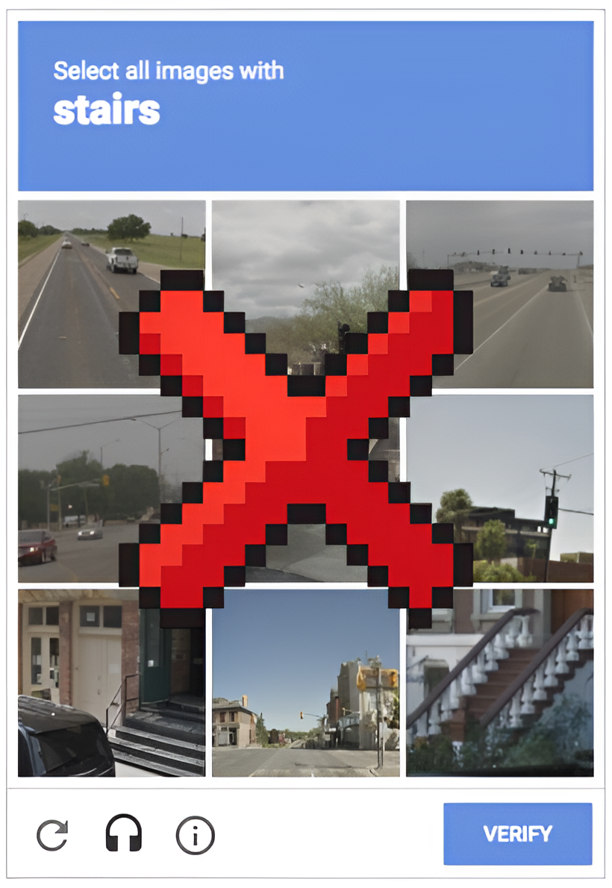
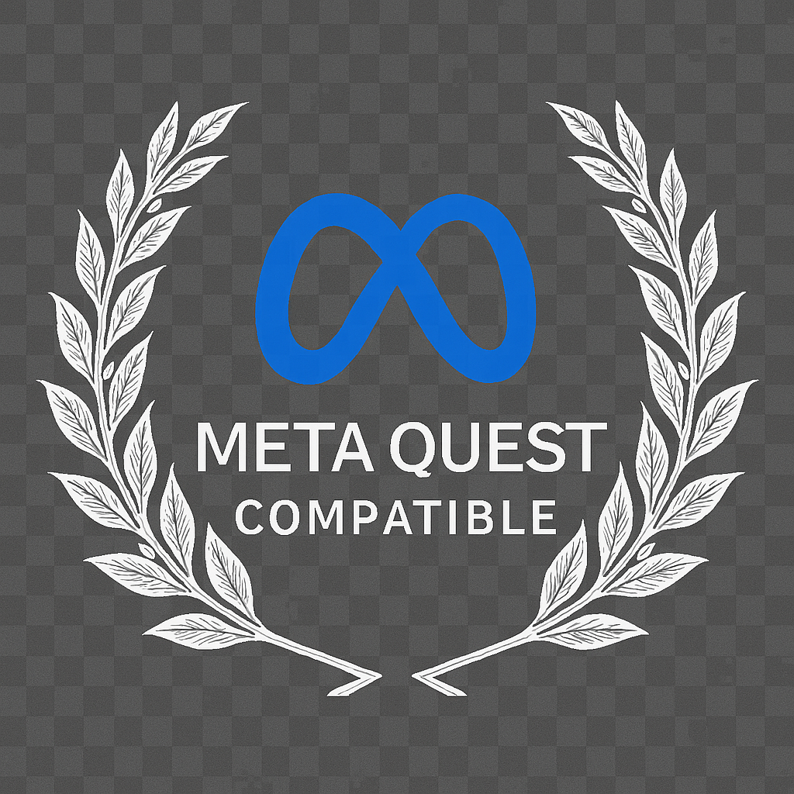

# 🚀 RetroCAPTCHA – Human Verification, Reimagined  

> *“Prove you're human... by saving the galaxy.”*

---

  

---

## 🤔 Why?  
Old CAPTCHAs are broken.  
They're frustrating, outdated, and sometimes even wrong (seriously, how are *those* not stairs?).

We built **RetroCAPTCHA** to make human verification **actually fun** — through games.

---

## 🎮 What We Built  
A fast-paced **retro Space Shooter**, built in JavaScript, where surviving = proving you're human.  
And yeah, it runs on **MetaQuest VR** too. Because why not dodge asteroids in 3D?

---

  

  

---

## 🤖 But What About Bots?  
We integrated a **pretrained Deep Q-Network (DQN)** model to simulate bot gameplay:  
- Didn't have time to train our own due to the 36-hour sprint  
- Ran the model once to benchmark performance  
- Calibrated our difficulty based on the result — humans win, bots don’t

---

## 🔥 Features  
- 🎯 Play-to-verify CAPTCHA  
- 🤖 Bot resistance with real ML testing  
- 🕶️ VR-Ready (MetaQuest support)  
- 📦 Modular + embeddable  
- 🕹️ More games coming soon (Pong, Snake, Brick Breaker...)

---

## 🛠️ Tech Stack  
- **Frontend:** JavaScript, HTML, CSS  
- **Backend:** Node.js, Express  
- **ML:** TensorFlow (DQN pre-trained model)  
- **VR:** WebXR for MetaQuest

---

## 👨‍🚀 Team RetroCAPTCHA  

| Name             | Role                           |
|------------------|--------------------------------|
| **Manit Garg**   | Game Dev + Backend             |
| **Pranav Karra** | Machine Learning + AI Testing  |
| **Pihu Agarwal** | Research + Game Logic Design   |
| **Dhruva Nagesh**| Frontend + VR Integration      |

⏱️ **36 hours non-stop**  
🍕 **Infinite pizza slices**  
😵 **Zero sleep**  
Built at **HackPSU Spring 2025** — and still alive (barely).

---

## 🌌 What’s Next  
- 🎮 Add more mini-games  
- 🚀 Train and fine-tune our own bot  
- 🌍 Deploy live + API support  
- 📱 Mobile-ready version  
- 🧑‍🦯 Accessibility upgrades

---

## 🎥 Demo  
Coming soon:  
✅ Gameplay GIF  
✅ VR Footage  
✅ Live link

---

> *Fun for humans. Frustrating for bots.*  
> **RetroCAPTCHA** – Arcade-style verification done right.
