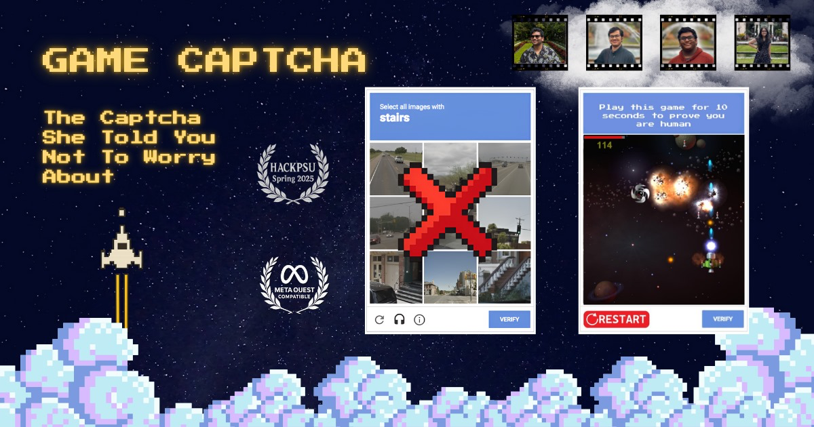
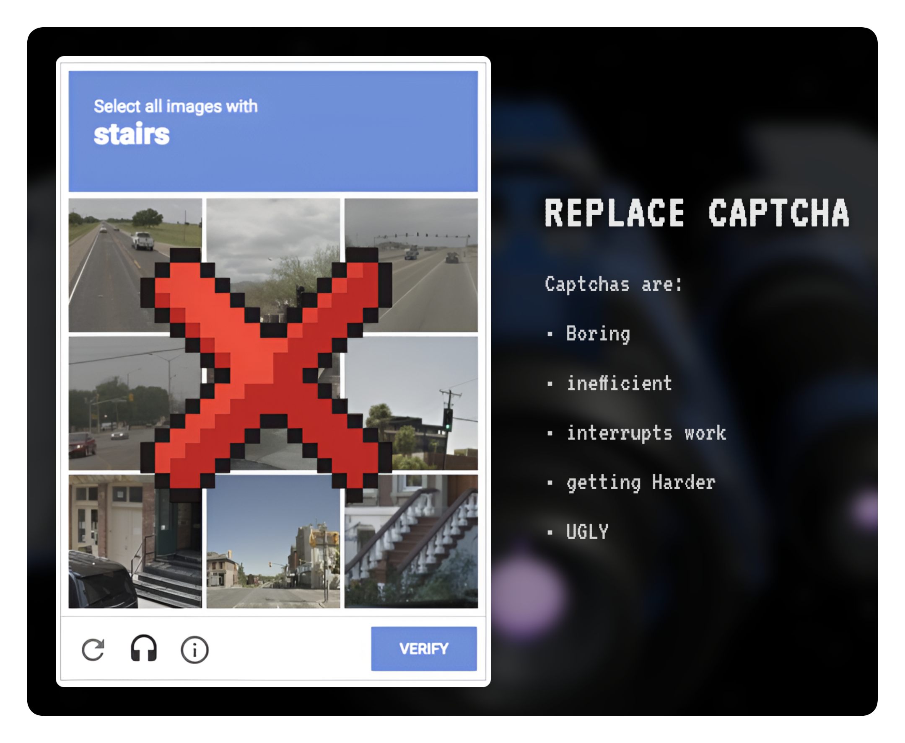
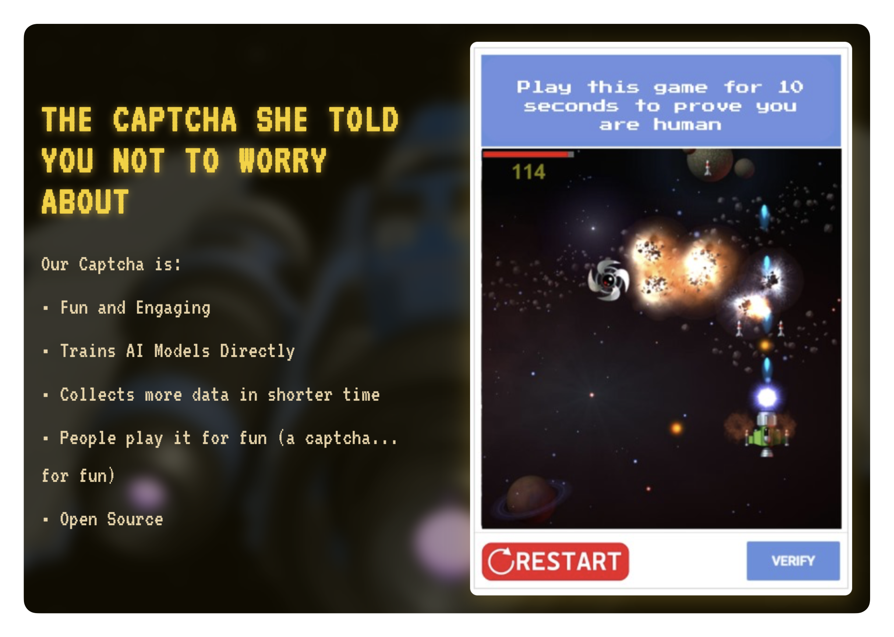
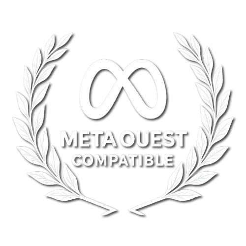
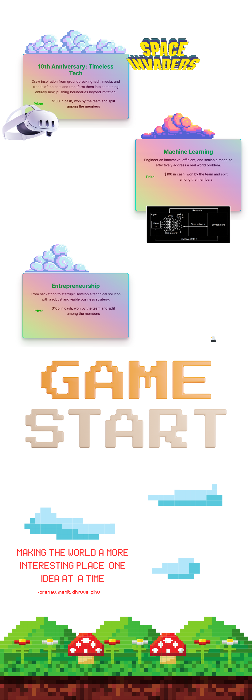

# 🚀 I am a gamer not a robot – Human Verification, Reimagined  

  

> *"Prove you're human... by saving the galaxy."*

---

  

<h1 align="center">INSTEAED</h1>

  

---

## 🤔 Why?  
Old CAPTCHAs are broken.  
They're frustrating, outdated, and sometimes even wrong (seriously, how are *those* not stairs?).

We built **I am a gamer not a robot** to make human verification **actually fun** — through games.

---

## 🎮 What We Built  
A fast-paced **retro Space Shooter**, built in JavaScript, where surviving = proving you're human.  
And yeah, it runs on **MetaQuest VR** too. Because why not dodge asteroids in 3D?

---

  
  

---

## 🤖 But What About Bots?  
We integrated a **pretrained Deep Q-Network (DQN)** model to simulate bot gameplay:  
- Didn't have time to train our own due to the 36-hour sprint  
- Ran the model once to benchmark performance  
- Calibrated our difficulty based on the result — humans win, bots don't

---

## 🔥 Features  
- 🎯 Play-to-verify CAPTCHA  
- 🤖 Bot resistance with real ML testing  
- 🕶️ VR-Ready (MetaQuest support)  
- 📦 Modular + embeddable  
- 🕹️ More games coming soon (Pong, Snake, Brick Breaker...)

---

## 🛠️ Tech Stack  
- **Frontend:** Next.js, Phaser.js, React
- **Backend:** Railway, Supabase
- **ML:** TensorFlow, TensorFlow.js (DQN pre-trained model)
- **VR:** WebXR for MetaQuest

---

## 👨‍🚀 Team I am a gamer not a robot  
| Name             | Role                                      |
|------------------|------------------------------------------|
| **Pranav Karra** | Machine Learning, Web Dev, Design, Backend|
| **Manit Garg**   | Game Dev + Backend                       |
| **Dhruva Nagesh**| Web Dev, Design, Testing                 |
| **Pihu Agarwal** | Research, Business Plan, Testing, Web Dev|

⏱️ **36 hours non-stop**  
🍕 **Infinite pizza slices**  
😵 **Zero sleep**  
Built at **HackPSU Spring 2025** 

---

## 🌌 What's Next  
- 🎮 Add more mini-games (eg: Dinosaur Game, Pac-Man, Tetris..)
- 🚀 Train and fine-tune our own bot  
- 🌍 Deploy live + API support  
- 📱 Mobile-ready version  
- 🧑‍🦯 Accessibility upgrades

---

> *Fun for humans. Frustrating for bots.*  
> **I am a gamer, not a robot** – Arcade-style verification done right.

---

  

---

  

---

## 🪞 Transparency  

**What we use:**  
- **ChatGPT Plus** – 2 members used ChatGPT Plus ($20 each)  
- **CURSOR (AI IDE)** – Paid by student org  
- **Claude Pro** – Paid by student org  
- **Vercel** – Free tier  
- **Supabase** – Free tier  
- **Railway** – $5 free credit  
- **Domain** – Free via sponsor  
- **Special thanks:**  
  - **Kanishk Sachdeva** – Helped us fix our file structure for Next.js when it wasn't working and we were stuck  

---

**Built with pixels, caffeine, and friendship.**